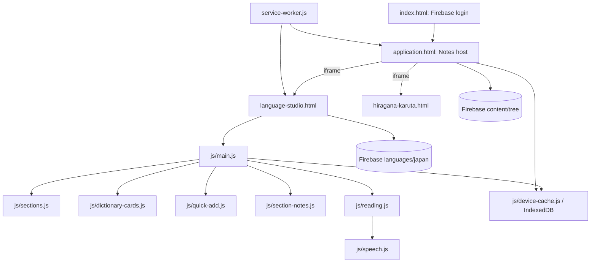

# Architecture And Code-Routing Blueprint

This is the fast map for project-level changes. Start with the task-routing table, then read only the owning feature and its listed dependencies. Source code is authoritative; update this blueprint in the same change whenever a code behavior, data contract, or integration described here changes. See [AGENTS.md](AGENTS.md) for the mandatory completion gate.

## Runtime Shape

### Execution And Integration Boundaries

- `index.html` authenticates with Firebase compat SDKs. It records `loginMethod` and `userRole` in local storage, audits successful Google sign-ins under `metadata/users` and `metadata/loginHistory`, then redirects to the validated `redirect` parameter or `/application.html`. Access-code sign-ins are not written to this Google-login audit.
- `application.html` is the Notes shell and host. It owns the Notes tree, Notes content/editor, Firebase tree index, Recently deleted workflows, service-worker registration, and interactions with the Language iframe. Its large inline module means a Notes-host change usually belongs here, not in the Language Studio modules.
- `language-studio.html` supplies the Language UI and loads `js/main.js`. Firebase compat globals are loaded before that ES module. `main.js` handles app-level auth/admin state, global event wiring, and feature bootstrap; feature behavior belongs in its focused modules below.
- `application.html` embeds `language-studio.html` in `#language-studio-frame`. Language Studio posts the `language-studio-mode-shortcut` message to its parent; the host handles mode switching. Notes also exposes `window.archiveLanguageWordToTrash`, `window.archiveLanguageSectionNoteToTrash`, and `window.removeLanguageWordFromTrash` for Language deletion/recovery integration. Preserve the same-origin assumption and update both sides when changing these contracts.
- `js/script-practice.js` sets the script-practice iframe to `hiragana-karuta.html?script=<key>`. The practice page is independently usable and does not import the Language Studio module graph.
- `service-worker.js` owns static shell caching, navigation fallback, and cache-version invalidation. Add newly required offline shell files there and increment `SHELL_CACHE` when a cache refresh is required.

## Task-To-Code Routing

| Prompt keywords / requested behavior | Start here | Follow these dependencies/contracts |
|---|---|---|
| Login, Google login audit/history, access code, redirect, admin/read-only role | `index.html`: `rememberLogin`, `recordGoogleLogin`, popup and redirect result handlers | Google audit records go to `metadata/users/{uid}` and `metadata/loginHistory/{uid}/{eventId}`. Auth role is inferred client-side and is not a security boundary. Firebase Rules must permit each authenticated user to access only their own metadata paths. |
| Open in the last mode (Languages or Notes) after refresh/login, per device and per user | `application.html`: `restoreStartMode`, `rememberMode` (called from `syncModeToggle`), `readDeviceMode`, `readAccountMode` | `localStorage` `lastAppMode:{uid}` and Firebase `metadata/users/{uid}/lastMode`; flow under "App Start Mode". |
| Notes tree, page CRUD, editor, tree search/navigation, restore, Recently deleted, red permanent-delete × | `application.html`: `renderTree`, `appendTreeNode`, `writeElement`, `treeIndexUpdates`, `softDeleteElement`, `restoreElement`, `purgeExpiredDeletions` | Trash tree nodes show the permanent-delete × only to admins; deleting a grouping node removes its subtree. Notes use `content/tree`; tree index/cache updates and trash restore must stay consistent. Language deletions cross the explicit `window` bridge described above. |
| Language section list, section hierarchy, filtering, summaries, lazy word loading, heading layout (name, NOTE tag, count pill pushed right; no buttons), double-click heading to start the reading player, admin tap-then-hold heading to add/edit its note, section edge colors/priority (thin left line; triple-click heading to pick), section operation mode (3-second long press on heading: inline rename/move/merge/make-child/delete), section index | `js/sections.js` (row actions: `buildSectionDetailsShell`; gestures: `attachHeadingGestures`, `swallowNextClick`; edges: `SECTION_EDGE_COLORS`, `getSectionEdge`, `getSectionEdgePriority`, `setSectionEdge`, `sectionSort`, `openSectionEdgePicker`, `buildInlineEdgePicker`; operation mode: `openSectionRename`, `buildInlineRenameEditor`, `fillInlineMoveEditor`, `renameSection`, `confirmSectionMerge`, `confirmSectionNest`, `closeSectionMenu`) | `js/state.js`, `js/firebase-init.js`, `js/device-cache.js`, `js/dom.js`, `js/dictionary-cards.js`, `js/section-notes.js`; database paths below. |
| Add a word, multi-stage entry, translation/romaji conversion, subsection creation | `js/quick-add.js` | Uses `js/translate.js`, `js/utils.js`, Firebase helpers, `js/state.js`, and section APIs in `js/sections.js`. Existing-word lookup/add/update touches both word records and section counts. |
| Word card appearance, edit, move/drag, delete/archive | `js/dictionary-cards.js` | Rendering from `js/sections.js`; updates through `js/firebase-init.js`; delete archives through the parent Notes host before deleting the Language record. |
| Section note display (clickable NOTE tag after the section name in the heading; shows/hides the note first in the open section body), edit/save/cache | `js/section-notes.js` (`buildNoteTag`, `hasSectionNote`, `toggleSectionNote`, `syncNoteTag`, `renderSectionNoteInto`, `openNoteEditor`) | Note HTML is in Firebase `sectionNotes`; uses `js/sections.js` for section labels/render refresh and `js/device-cache.js` for local note cache. Section deletion archives notes through the Notes host before clearing them. |
| Read-aloud mode, section queue, next/previous word | `js/reading.js` | Text preparation and audio playback in `js/speech.js`; section enumeration/lazy loads from `js/sections.js`; DOM references in `js/dom.js`. |
| Speech text cleanup, voice choice, synthesis, keep-alive | `js/speech.js` | Romanization and conversions in `js/translate.js`. Browser Web Speech API behavior varies by browser/OS. |
| Translation, Japanese romanization, kana/romaji conversion | `js/translate.js` | Kanji/text helpers in `js/utils.js`; called by quick-add and speech. |
| Script-practice modal open/close or iframe selection | `js/script-practice.js` | DOM contract in `js/dom.js`; actual charts, decks, and quiz behavior in `hiragana-karuta.html`. |
| Shared app state or language state lifecycle | `js/state.js` | State is imported directly by feature modules; coordinate lifecycle changes with `js/sections.js` and `js/main.js`. |
| Cached DOM selector / missing element | `js/dom.js` | IDs must match markup in `language-studio.html`; Notes host DOM is directly managed in `application.html`. |
| Firebase initialization, atomic Language updates, offline conflict/sync | `js/firebase-init.js` | Queue/persistence in `js/device-cache.js`; callers in `js/sections.js`, `js/quick-add.js`, `js/dictionary-cards.js`, and `js/section-notes.js`. Update affected read/write paths and marker behavior together. |
| IndexedDB cache schema, queue, migrations, browser storage failures | `js/device-cache.js` | Consumers: Language cache scopes in feature modules; Notes cache operations in `application.html`. Check cache-version and offline replay contracts. |
| Shared normalization, escaping, kana/kanji helpers | `js/utils.js` | Call sites across quick-add, cards, sections, notes, translation. Preserve input/output expectations across callers. |
| App installation, offline navigation/static resources, cache invalidation | `service-worker.js`, `manifest.webmanifest` | Ensure new entry points and required modules are included in `SHELL_FILES`; test both online and offline navigation behavior. |
| Firebase project or browser config | `firebase-config.js` and `index.html` | Config is currently duplicated in `index.html`; account for both initializations. Never treat client config as authorization. |

## Language Studio Module Responsibilities

| File | Owns | Main connections |
|---|---|---|
| `js/main.js` | Language Studio bootstrap; auth/admin gate; global key, theme, logout, quick-add, reading, practice, and outside-click event wiring. | Imports feature modules and `state`; starts `switchLanguage` only after role is known. |
| `js/state.js` | Shared mutable session/UI state and `langCodeMap` (`japanese` → `ja`). | Imported by all stateful feature modules; no persistence of transient UI fields unless explicitly implemented elsewhere. |
| `js/firebase-init.js` | Firebase app/database/auth, `japanRef`, `wordsRef`, Language update marker, atomic `updateJapanData`, offline enqueue and conflict-safe `syncPendingLanguageWrites`. | Uses `firebase-config.js` and `device-cache.js`. |
| `js/sections.js` | Section normalization/hierarchy, discovery/index, summary/list rendering, caches/subscriptions, create/rename/merge/make-child/delete, section word loading and rendering. | Core coordinator; invokes cards, quick-add, reading, section notes; reads/writes Firebase helpers. |
| `js/dictionary-cards.js` | Word-card render/edit/save/move/drag/delete behavior. | Calls section count/cache/render helpers; deletion calls Notes host archive bridge before deleting source data. |
| `js/quick-add.js` | Quick-add UI state, field resolution, word/section creation and save. | Translation/util functions, state, Firebase, sections, DOM. |
| `js/section-notes.js` | Lazy note load; a clickable NOTE tag in the heading (`.section-note-tag`) that shows/hides the full note (`.section-note`) at the top of the body, with the shown state in `state.expandedNotes` (UI only, cleared on language switch); Quill editor, save/cache, cached note movement. | Firebase `sectionNotes`, device cache, section labels and body rerender. |
| `js/reading.js` | Reading session/queue controls and modal state. | Section word loading, `speech.js`, DOM elements. |
| `js/speech.js` | Speech normalization, browser voice selection/synthesis, audio keep-alive, spoken-text conversion. | Romanization in `translate.js`. |
| `js/translate.js` | Translation and Japanese text conversion/transliteration utilities. | Uses `utils.js`; consumed by quick-add and speech. |
| `js/dom.js` | Cached DOM element references for Language Studio. | Every referenced ID must exist in `language-studio.html`. |
| `js/device-cache.js` | IndexedDB abstraction for cached data, metadata, and pending operations. | Used by Firebase sync and feature-level caches. |
| `js/utils.js` | Shared pure string/word normalization, escaping, kana/kanji-related helpers. | Cross-cutting; check all callers when changing semantics. |
| `js/icons.js` | Reusable SVG path constants. | Imported by feature UI such as sections. |
| `js/script-practice.js` | Modal lifecycle and iframe URL selection. | `hiragana-karuta.html`, `dom.js`. |

## Data And Persistence Contracts

### Firebase Realtime Database

| Path | Shape / role | Primary owners |
|---|---|---|
| `languages/japan/words/{language}/{section}/{id}` | Word record `{ w, p, em, c }` (word, pronunciation, English meaning, created timestamp). A section key may include `TOP>SUBSECTION`. | `sections.js`, `dictionary-cards.js`, `quick-add.js`. |
| `languages/japan/sectionSummary/{language}/{section}` | Per-section word count. Drives section headers and summary/index reconstruction. | `sections.js`; updated alongside word add/move/delete/restore. |
| `languages/japan/sectionIndex/{language}` | Versioned section/child index with paths and counts. It lets the list render before the live summary loads, and gives word-load paths. Once `sectionSummary` has loaded, the live counts come from the summary and the index is not used for them (it can lag). | Built/synchronized in `sections.js`; consumers use index paths for lazy loads. |
| `languages/japan/sectionNotes/{language}/{section}` | `{ html, updatedAt, updatedBy }` rich-text note. | `section-notes.js`; section rename/merge/delete in `sections.js`; deleted-note recovery in Notes host. |
| `languages/japan/hiddenSections/{language}/{section}` | Explicit hidden-section flag. | `sections.js`. |
| `languages/japan/sectionEdges/{language}/{section}` | Edge color key `red` / `orange` / `green` / `purple` (priority 1–4); absent = default `blue` (priority 5). Device cache key `section-edges`. | `sections.js`: `setSectionEdge` writes; moved by `addSectionKeyMoveUpdates`; cleared by merge (subsections keep theirs unless the target already has one) and delete. |
| `languages/japan/starredSections/{language}/{section}` | Legacy "top 5" star (`true`), read-only now: a starred section with no edge color sorts as `red`. `setSectionEdge` clears it; rename/move carry it; merge/delete clear it. No UI writes new stars. | `sections.js`. |
| `contentUpdateMarkers/language` | Cross-client Language change marker, also updated by Language restore paths. | `firebase-init.js` and Notes-host restore bridge. |
| `metadata/users/{uid}` | Google-auth profile summary: `uid`, `email`, `displayName`, `photoURL`, `provider`, `firstLoginAt`, `lastLoginAt`, and `loginCount`. | `index.html:recordGoogleLogin`; transactionally updates summary for each successful Google sign-in. |
| `metadata/users/{uid}/lastMode` | `{ mode: 'language' \| 'notes', at }`: the mode the user was last in, so the app reopens there on any device. Written for every signed-in user (Google and access code) on each Notes/Languages change. `recordGoogleLogin`'s transaction spreads the existing profile, so it keeps this child. | `application.html`: `rememberMode` (write, best-effort), `readAccountMode` / `restoreStartMode` (read at startup). |
| `metadata/loginHistory/{uid}/{eventId}` | One `{ at, provider }` event per successful Google sign-in. | `index.html:recordGoogleLogin`; event IDs are generated with Firebase `push()`. |
| `content/tree/...` | Notes nodes with `description`, metadata, and `children`; trash nodes store `deleted` recovery metadata. | Inline Notes implementation in `application.html`. |
| Notes tree index and `contentUpdateMarkers/notes` | Versioned lookup/index/cache marker for Notes tree reads and updates. | Inline tree-index/cache logic in `application.html`. |

### Local Persistence And Offline

- `application.html` keeps the last Notes/Languages mode in `localStorage` key `lastAppMode:{uid}` as `{ mode, at }` (see "App Start Mode" below).
- `js/device-cache.js` wraps IndexedDB access, metadata, and queued operations. Language records use operation kinds such as `language-update`, keyed to the signed-in user and replayed with expected-base checks.
- Language cache scopes include user identity and language; section summaries/indexes/word lists/notes have separate cache entries in the relevant modules.
- `application.html` uses its own Notes cache scope and queue for Notes element operations. Do not merge these queue formats without migrating/replaying existing records.
- `service-worker.js` caches the static app shell and same-origin navigation fallback. Firebase JSON/data requests are intentionally not treated as static shell assets.
- Google login metadata writes are online Firebase Realtime Database writes from `index.html`; they are best-effort and do not use the Language offline queue. A rules/network failure warns in the console but does not block authentication or redirect.

## Cross-Feature Behavior Flows

### App Start Mode (Reopen In Languages Or Notes)

1. Every mode change ends in `syncModeToggle` (via `enterLanguageMode` or `clearRightPanel`), which calls `rememberMode`. It writes only when the mode actually changes and only after startup has restored the mode (`modeTracking.ready`), saving `{ mode, at }` to `localStorage` `lastAppMode:{uid}` and to `metadata/users/{uid}/lastMode`. A denied or offline Firebase write is logged, not shown.
2. In `onAuthStateChanged`, `restoreStartMode` runs before the Notes tree loads. It uses this device's entry at once; with none (new device, first login, cleared storage), it waits up to `MODE_READ_TIMEOUT_MS` = 2500 ms for the account entry, else Notes. If the start mode is Languages it calls `enterLanguageMode` right away, so the Language Studio iframe loads first and the Notes home is never shown. The tree still loads in the background; the final `showNotesHome` runs only when not in Languages.
3. When this device had an entry, the account entry is still read. If it is newer and differs (switched on another device), it's applied when it arrives, unless the mode was already changed here or an edit is open.

### Language Word Delete And Restore

1. `js/dictionary-cards.js:deleteWordEntry` asks parent `application.html` to archive `{ language, section, id, data }` via `window.archiveLanguageWordToTrash`.
2. The host stores the record beneath `content/tree/Recently deleted/children/Deleted Words/children/{language}/children/{section}/children/{word}` with `deleted.kind = language-word` and full restore payload.
3. Only after archive succeeds does the Language module remove `words/{language}/{section}/{id}` and decrement the section count.
4. `application.html:restoreElement` restores the original word and increments the section count; duplicate IDs block restore.
5. The host’s trash expiry traversal removes expired deleted leaves and supports nested categories.

### Section List Live Updates (Counts, Create, Delete, Move)

1. `state.sectionSummary` (live `sectionSummary/{language}` listener, `subscribeSectionSummary`) drives the section list, header counts and the grand total (`updateEntryCounts`). Every word add/delete/move and section create/delete changes it, so `renderCurrentView` reflects changes without a page reload.
2. `state.discoveredSections` (sections found by `reconcileMissingSectionSummaryEntries` or `downloadLanguageContentInBackground` scanning `words/`) only fill gaps: the summary listener spreads them under the remote value and drops any key the remote summary now has. The background download records only sections missing from the live summary. `bumpSectionCount` and `forgetSections` also drop a section's discovered entry. Discovered counts must never override live ones; they used to, which froze counts and brought deleted sections back until a reload.
3. Header totals (`sectionCountLabel`, "subsections · words", no parentheses) render as a `.section-count` pill after `.section-label` (a direct `
` child, pushed to the right edge) built by `sectionCountBadge`, whose tooltip spells out "N subsections · M words" (`buildSectionDetailsShell` and the Unsectioned heading in `js/sections.js`; styled in `language-studio.html` as a small, muted, tinted pill that keeps its muted fill even under the hover/open gradient). They come from `sectionSummary` once `state.sectionSummaryLoaded` is true. The `sectionIndex` totals are used only before that, because the index lags: only an admin session's `syncSectionIndex` rewrites it, and that write can fail.
4. Local writers also update the UI directly. `deleteWordEntry` and the quick-add save update `state.sectionCache` and re-render. `moveWordEntry` and quick-add's "move the existing word here" update both sections' cached words and call `renderCurrentView`. `deleteSectionEntirely` drops the deleted keys from `state.sectionSummary` and re-renders right away. When a section's last word is deleted, its count transaction writes `null`, so the emptied section leaves the list; `createNewSection` seeds `0` for a new, empty section.

### Section Edge Colors And Priority (Triple-Click Heading)

1. Every section row (`.section-row`) carries `data-edge` from `getSectionEdge` (`--section-edge` in `language-studio.html`), and each row draws one line in that color. A top-level section gets a hair-thin line beside its heading only: `summary::before`, 1px scaled with `transform: scaleX(0.5)` (`0.25` at ≥2dppx), because browsers round sub-pixel widths up. It doesn't run down the open body. A subsection's indent (tree) line (`.section-row-sub::before`) is colored instead, with no second line. It is drawn at half a pixel: 1px scaled with `scaleX(0.5)`. Visible to everyone.
2. `SECTION_EDGE_COLORS` sets the order: 1 red, 2 orange, 3 green, 4 purple, 5 blue (default). `sectionSort` compares `getSectionEdgePriority` first, so same-colored sections sit together in priority order, then UNCATEGORIZED-last and alphabetical within a color. Subsections sort the same way under their parent.
3. Admin fast triple-click/triple-tap on a heading (`attachHeadingGestures` pointerup; each tap within `EDGE_TAP_GAP_MS` = 300 ms of the previous, counted per section in `lastHeadingTap`) calls `openSectionEdgePicker` (`state.sectionMenu = { section, mode: 'edge' }`). The third tap's click goes through `swallowNextClick`, so the `
` doesn't toggle (the first two taps' open+close cancel out) and the `js/main.js` outside-click handler doesn't close the picker. The guard ends at the next pointerdown or after 600 ms, because a mouse press whose heading re-rendered under it gets no click.
4. `buildInlineEdgePicker` replaces the label with five numbered swatches (`.section-edge-swatch`, current one ringed) and ✕. A swatch calls `setSectionEdge`: one `updateJapanData` write of `sectionEdges/{language}/{section}` (null for blue) plus clearing the legacy `starredSections` entry, then caches and re-renders.

### Section Operation Mode (3-Second Long Press On Heading)

1. Admin press-and-hold on a section heading for `OPS_LONG_PRESS_MS` = 3000 ms (`attachHeadingGestures`; moving more than `LONG_PRESS_MOVE_PX` = 10 px, pointercancel, or pointerleave cancels it) calls `openSectionRename`, which sets `state.sectionMenu = { section, mode: 'rename' }` and re-renders. While held, `.section-long-pressing` sweeps a soft fill across the heading (its rule has a `.dark` variant so the dark odd-row stripe (a full-width tint that fades from about 0.06/0.07 to half that at the right edge, never to transparent), `.dark .section-row:nth-child(odd) > … > summary`, can't out-specify it and hide the fill on every other heading). On release, `swallowNextClick` stops the click, so the section doesn't toggle and the outside-click handler doesn't close the editor. `longPressFired` stops the release from counting as a triple-tap tap. The heading cancels `contextmenu` during a press and sets `-webkit-touch-callout: none`. A double-click/double-tap on any heading (everyone, not just admins; second tap within `EDGE_TAP_GAP_MS`) calls `startSectionReading`; the two clicks open and close the section, so it ends as it was. For admins the start waits another `EDGE_TAP_GAP_MS` (`pendingDoubleTap`) and a third tap cancels it in favor of the edge picker. The summary sets `touch-action: manipulation` so mobile double-tap doesn't zoom. Admin tap-then-hold (a press starting within `EDGE_TAP_GAP_MS` of a single tap, held `NOTE_HOLD_MS` = 500 ms; `noteTimer`) calls `openNoteEditor` to add the note or edit the existing one. It flips the section's `
` back (looked up through `state.sectionHeaderDomRefs`, since the heading may have re-rendered) to undo the first tap's toggle, and goes through the same `fireHold` path as the long press (`longPressFired`, `swallowNextClick`). Releasing before 500 ms counts as the second tap of a double-tap. There are no heading buttons (no play, note, ⋮ kebab or star button). The heading reads: `.section-label`, the NOTE tag (when present), then the `.section-count` pill (`margin-left: auto`, so it sits at the right edge). Rename/move/merge/delete exist only in operation mode.
2. `buildSectionDetailsShell` then renders `buildInlineRenameEditor` inside the heading's `
` instead of the label (`.section-rename-inline`, `.section-menu-sym-btn` in `language-studio.html`). `state.sectionMenu.op` picks the row:
   - `rename` (default): name input, ✓ save, ⤷ move/merge (sets `op = 'move'`), 🗑 delete (`closeSectionMenu` then `deleteSectionEntirely`), ✕ cancel.
   - `move` (`fillInlineMoveEditor`): target input on the shared `#section-merge-options` datalist (`fillSectionMergeOptions`), ↳ make child (`confirmSectionNest`), ⊕ merge words (`confirmSectionMerge`; also Enter), ✕/Escape back to the rename row.
   Editor clicks preventDefault (no `
` toggle) and stopPropagation (the outside-click handler closes the edit). Typed text is kept in `state.sectionMenu.draft` / `.moveDraft` across live re-renders.
3. Enter or ✓ calls `renameSection` (refuses `>`, Firebase-illegal characters, and existing names, then moves keys via `addSectionKeyMoveUpdates`). Escape, ✕, or a click outside cancels via `closeSectionMenu`. Move/merge follow the rules below; a refused target keeps the editor open.

### Section Move: Merge Or Make Child (Operation Mode ⤷)

1. In operation mode, ⤷ sets `state.sectionMenu.op = 'move'`; `fillInlineMoveEditor` shows the target input (autocomplete from `fillSectionMergeOptions` into `#section-merge-options`) and compact symbol buttons: ↳ make child, ⊕ merge words, ✕ back to rename.
2. **⊕ Merge** (`confirmSectionMerge` → `mergeSectionInto`): source words join the target's words with summed counts; the source's subsections are re-parented as `TARGET>CHILD` (merged with same-named ones); notes append via `addNoteMergeUpdates`; source keys are removed.
3. **↳ Make child** (`confirmSectionNest`): the target must be an existing top-level section other than the source's current parent; disabled when the source has subsections (one nesting level only). The source moves intact to `TARGET>NAME` through `addSectionKeyMoveUpdates` (words, `sectionSummary`, hidden/starred flags, note; the same helper `renameSection` uses). If `TARGET>NAME` already exists, it asks for confirmation and then merges into it with `mergeSectionInto`.
4. Each action writes once through `updateJapanData`; `forgetSections` drops old-key caches/listeners, and the section index resyncs from the `sectionSummary` change.

### Section Note Display (NOTE Tag In The Heading)

1. A section whose note is loaded and non-empty (`hasSectionNote`) gets a small clickable NOTE tag right after its name in the heading. `buildSectionDetailsShell` inserts `buildNoteTag` right after `.section-label` (before the count pill). The tag (`.section-note-tag` in `language-studio.html`) is a lighter violet than the heading, with no icon, and filled while the note is shown. It is visible only while the section is open: CSS hides it under `.section-group:not([open])`. Notes still load lazily when a section first opens, so a section's tag appears once its note is known (`syncNoteTag` adds or removes it after the load).
2. `renderSectionBodyIfPresent` (`js/sections.js`) calls `renderSectionNoteInto` on every render. It prepends `.section-note-holder` (hidden while empty) to the body, so a shown note comes before the section's subsections and words. Words render unchanged.
3. A click, Enter or Space on the tag preventDefaults (the heading doesn't toggle) and calls `toggleSectionNote`. It flips `state.expandedNotes` and refills only the holder. The shown state survives closing and reopening the section. `attachHeadingGestures` ignores presses on the tag, so tag clicks don't count toward the triple-click or long press.
4. The shown note is the full Quill HTML (`.section-note`). `fillNoteHolder` runs `fixHighlightContrast` on it before display: every element with an inline background (Quill highlight, alpha ≥ 0.5) gets near-black or near-white text by the background's luminance, and explicit text colors inside it are kept unless their contrast is under 3:1. It changes only the displayed DOM, never the stored note, and doesn't depend on the theme. The editor modal shows the raw colors; admins double-click or double-tap it to edit (`openNoteEditor`). Saving a non-empty note marks it shown; saving an empty note hides it and removes the tag.

### Section Note Delete And Restore

1. `js/sections.js:deleteSectionEntirely` reads notes for the section and its children before removal.
2. It archives each non-empty note through `window.archiveLanguageSectionNoteToTrash`, beneath `Recently deleted/Deleted Notes/{language}`, with source section and note payload.
3. Section data/summary/note paths are removed together. On a failed section update, newly archived notes are rolled back where possible.
4. `restoreElement` restores the note to its original `sectionNotes` path and preserves the current section count. A pre-existing note blocks restore.

### Notes Page Delete And Restore

1. `application.html:softDeleteElement` copies a Notes page under the `Deleted Notes` category before deleting its original path.
2. Deleted page metadata preserves original parent/name and timestamp; restore returns it to its former parent when that parent still exists, otherwise to the top-level Notes tree.
3. Trash tree rows render an admin-only permanent-delete control. Removing a grouping node removes its descendants; removing a leaf preserves siblings.

### Google Sign-In Audit

1. A successful Google popup result calls `recordGoogleLogin` before navigation. Redirect sign-in sets a session marker; the auth-state auto-redirect waits until `getRedirectResult` records the returned user, preventing navigation from racing the audit write.
2. `recordGoogleLogin` verifies the user has the `google.com` provider, then transactionally upserts the summary at `metadata/users/{uid}` and writes a timestamped event under `metadata/loginHistory/{uid}/{pushId}`.
3. The audit stores UID, email, display name, photo URL, provider, first/last tracked login time, login count, and event timestamps. It does not store passwords or tokens. `firstLoginAt` means first login recorded by this app, not necessarily Firebase Auth account creation time.
4. Realtime Database Rules must constrain reads/writes to the authenticated owner UID for both paths. Because rules are administered outside this codebase and may deny the write, logging is non-blocking and reports failures to the console.

## Change And Verification Checklist

For every code change, use this checklist before declaring completion:

1. Route the prompt to one or more rows in **Task-To-Code Routing** and open the owning symbol plus its direct callers/dependencies.
2. Trace each affected data path through write, read/render, cache/index, offline replay, and restore/delete behavior as applicable.
3. Implement the smallest behavior change in its owning module; update every side of changed iframe, message, database, or cache contracts.
4. Update this blueprint’s affected module row, route, data schema, or flow in the same session. Update `PROJECT_OVERVIEW.md` if its high-level entry points or workflows changed. This documentation step is a hard completion requirement.
5. Run the narrowest available check and inspect the final diff. Note unavailable runtime/Firebase checks explicitly.